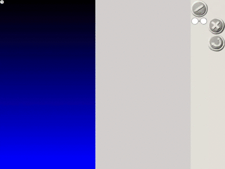

# Viscuit (ビスケット)

⚠️ This is research based on using translation tools

[Play with tool](https://develop.viscuit.com/env/publicarea.html)

- What is viscuit
- What is this repo for
- Why do this
  + There isn't much English resources about Viscuit
  + I wanted to colate all the knowledge I've found about it in English

## About

Viscuit is an visual programming language. It is primarly aimed for used in education with kids.

- It was created 2003
- Create a program by teaching a computer how to change (move) a picture using a part called "glasses".

> The background to the birth of biscuits is that in the current popular programming introductory languages, programming is too focused and it is difficult to understand the "essence of computers". For example, block-based visual programming languages ​​such as Scratch and programming have been taken to make it easier to get closer to today's mainstream programming languages.

> Biscuits are not an introductory language for programming, but for intuitive understanding that "computers are like this". By using biscuits with excitement and programming while having fun (without knowing it), you naturally develop your intuition for computers.

>Since 2003, biscuits have been used in various situations such as educational institutions, exhibition facilities, and events.
http://www.digitalpocket.org/viscuit/

## Design

## Philosophy
> Computer is clay!

NTT research based on the concept of "anyone can experience programming and understand the essence of computers."

- Mention about no more dead fish
- Easy for kids to use

## People

- Hakase Harada (原田　康徳) - https://twitter.com/viscuit

- Mr. Yasunori Harada ??

> Computer scientist. Workshop designer.
> Biscuit developer. Ph.D. (Engineering). Workshop designer. Born in Hokkaido in 1963. Completed the doctoral program at the Department of Information Engineering, Hokkaido University in 1992. 1992-2015 Nippon Telegraph and Telephone Corporation NTT Basic Research Laboratories, NTT Communication Science Research Laboratories 1998-2001 JST PRESTO Researcher. 2004-2006, 2010-2013 IPA unexplored software creation business project manager. After retiring from NTT, established a limited liability company Digital Pocket.

## Technical

- Created in Flash ActionScript 3 (AS3)
- iOS apps
- [Viscuit JSON file](#file-format)

## Using the tool

- Link to how to use

## Examples

- Games
- Sorting algorithm (link to blog example)

## Archive

- [All Viscuit blog posts](#scraped-posts)

## Links

- [Viscuit Homepage](https://www.viscuit.com/)
- Social media accounts that post Viscuit content
- Tutorials

## Future after Flash depreication

> New biscuits can be used without using flash. Here, I will tell you how to create a work with new biscuits, in addition to the "try it" and "play alone" that are currently open to the public.

> <Information> Due
to the transition to the new biscuit service, works created after November 1, 2020 in the "Harappa" environment stored on the old server will have a storage period of one month. Please note that even if the work is made with the new biscuit that we are introducing this time, the work made in the "Harappa" environment will be saved on the old server, so the storage period will be one month as well.
A new app that allows you to manage your work will be released at a later date. We are planning to open a work posting site with new functions, so please continue to enjoy biscuits.

https://www.viscuit.com/harappainfo/

Harappa (はらっぱ)

- Unknown what will happen

## Glossary

### Glasses
